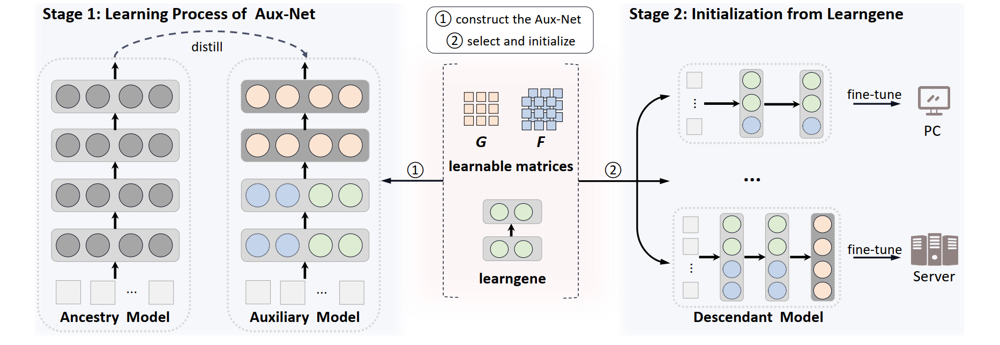

# Initializing Variable-sized Vision Transformers from Learngene with Learnable Transformation (NeurIPS 2024)

[](https://opensource.org/licenses/Apache-2.0) 
<a href="https://pytorch.org/get-started/locally/"></a>

This is the official PyTorch implementation of **NeurIPS 2024** paper [Initializing Variable-sized Vision Transformers from Learngene with Learnable Transformation](https://proceedings.neurips.cc/paper_files/paper/2024/file/4c5e2bcbf21bdf40d75fddad0bd43dc9-Paper-Conference.pdf).

**Title:** Initializing Variable-sized Vision Transformers from Learngene with Learnable Transformation

**Authors:** Shiyu Xia, Yuankun Zu, Xu Yang and Xin Geng

**Affliations:** Southeast University


## A Gentle Introduction of LeTs



In stage 1, we construct and train an Aux-Net which is transformed from compact learngene layers using a series of learnable transformation matrices. During training, F and G learn to capture structural knowledge about how to add new neurons and layers into the compact learngene respectively. In stage 2, given the varying sizes of target Des-Nets, we select specific parameters from well-trained transformation matrices to transform learngene for initialization, which are fine-tuned lastly under different downstream scenarios.


## Running LeTs

We provide the following shell codes for LeTs running. 

### Stage1: Training Aux-Net to obtain learngene

In stage 1, we train Aux-Net to obtain learngene.

```bash
python3 -u -m torch.distributed.launch --nproc_per_node=4 --master_port 20001 --use_env main.py --src-arch deit_small_patch16_224_L8 --tgt-arch deit_base_patch16_224_L16_H12 --batch-size 128 --epochs 300 --warmup-epochs 5 --data-path path-to-ImageNet-1K --output_dir path-to-output --weight-decay 0.05 --lr 5e-4 --teacher-model levit_384 --teacher-path path-to-teacher --distillation-type soft --distillation-alpha 1.0
```


### Stage2: Training Des-Nets after initializing with learngene

In stage 2, we train Des-Nets after initializing them with learngene.


#### Training 12-layer Des-H12-L12

```bash
python3 -u -m torch.distributed.launch --nproc_per_node=2 --master_port 20002 --use_env main.py --des-arch deit_base_patch16_224_L12 --batch-size 256 --epochs 5 --warmup-epochs 0 --data-path path-to-ImageNet-1K --output_dir path-to-output --weight-decay 0.05 --lr 1e-5 --min-lr 1e-6 --load-gene /path/to/learngene --mapping_layer '0,1,4,5,6,7,8,9,10,11,12,13' --mapping_layer_coeff '0,2,4,4,6,6,8,8,10,10,12,14'
```

Make sure you update the learngene path `/path/to/learngene`, where you place the learngene trained from the stage 1.


## Acknowledgement

This project is built based on [DeiT]([paper](https://proceedings.mlr.press/v139/touvron21a), [code](https://github.com/facebookresearch/deit)), [LiGO]([paper](https://arxiv.org/abs/2303.00980), [code](https://github.com/VITA-Group/LiGO/tree/main)) and [MiniViT]([paper](https://openaccess.thecvf.com/content/CVPR2022/html/Zhang_MiniViT_Compressing_Vision_Transformers_With_Weight_Multiplexing_CVPR_2022_paper.html), [code](https://github.com/microsoft/Cream/tree/main/MiniViT)).
We thank the authors for their released code and wonderful works.


## Citation

If you use LeTs in your research, please consider the following BibTeX to cite it and giving us a star🌟! Thank you!😊

```BibTeX
@inproceedings{xia2024initializing,
  title={Initializing variable-sized vision transformers from learngene with learnable transformation},
  author={Xia, Shiyu and Zu, Yuankun and Yang, Xu and Geng, Xin},
  journal={Advances in Neural Information Processing Systems},
  volume={37},
  pages={43341--43366},
  year={2024}
}
```

